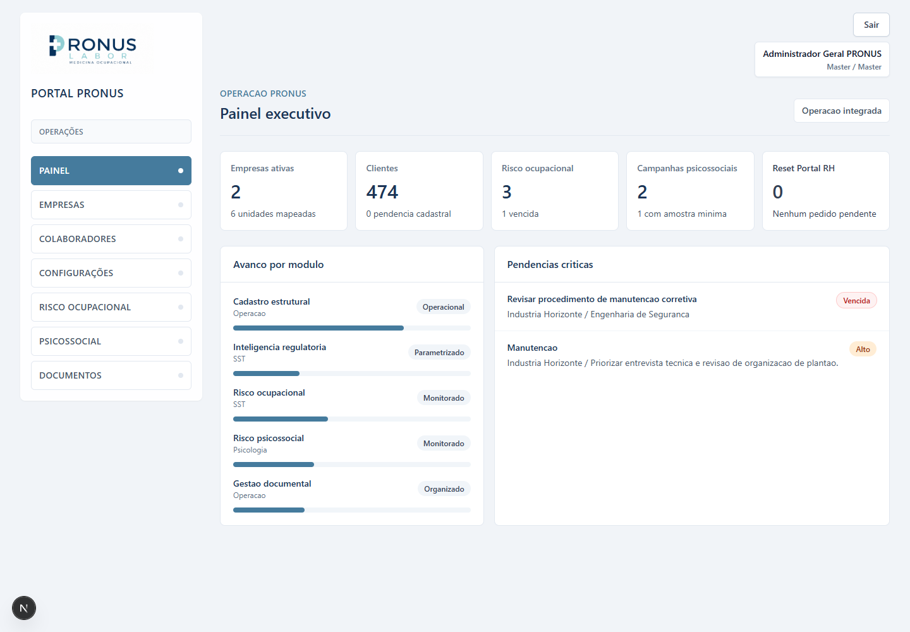
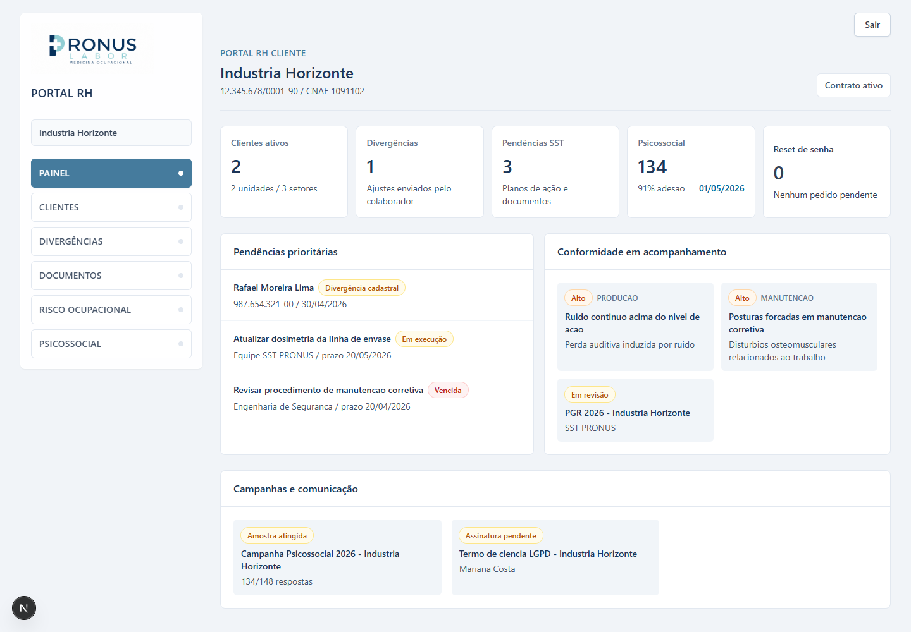
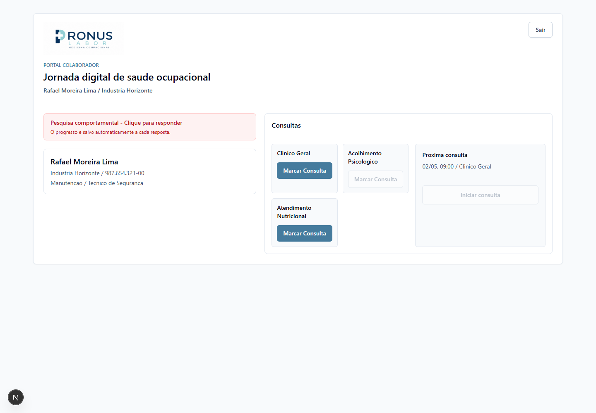
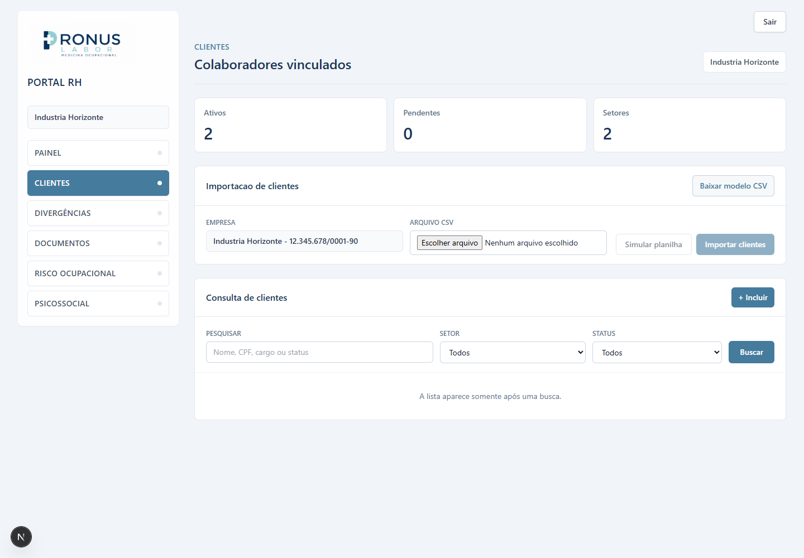
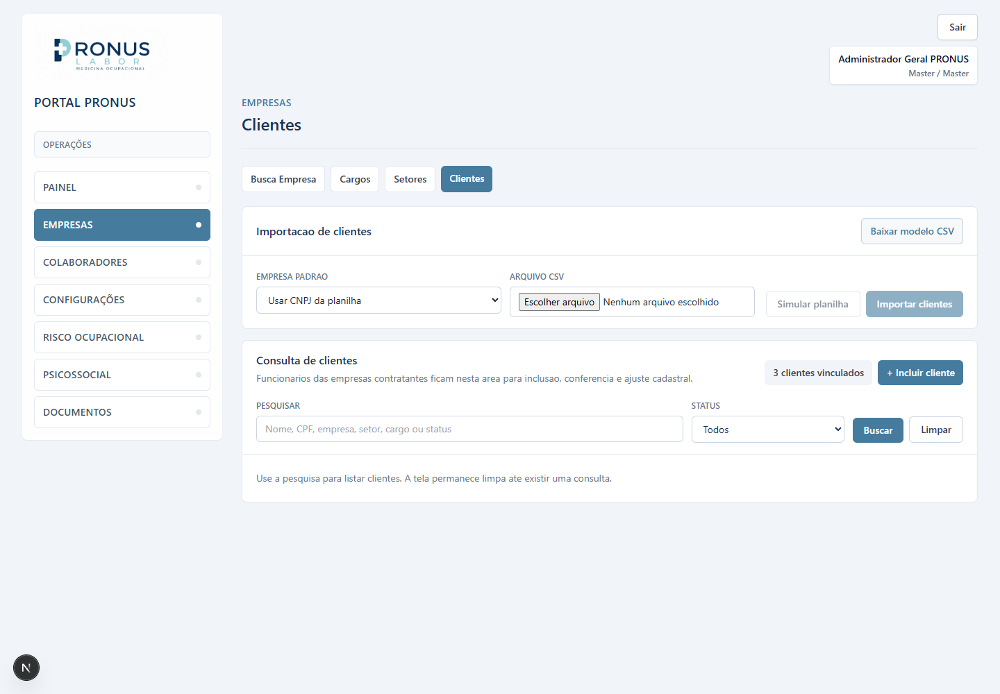
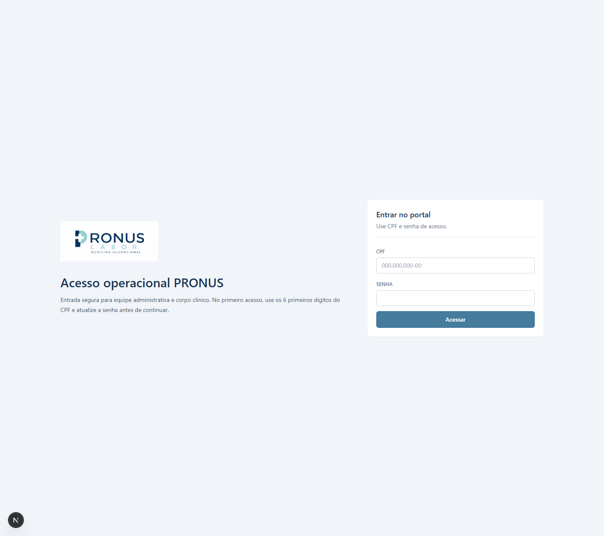
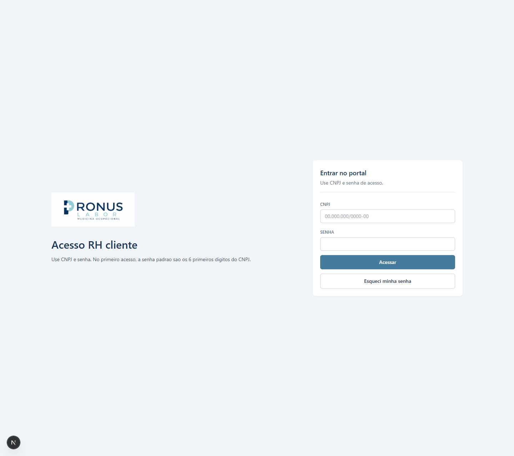
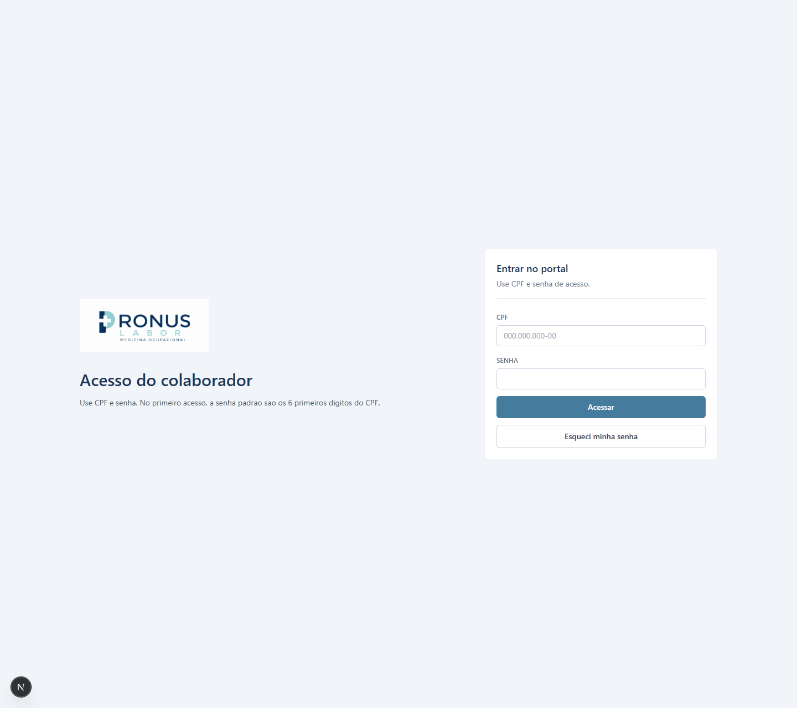
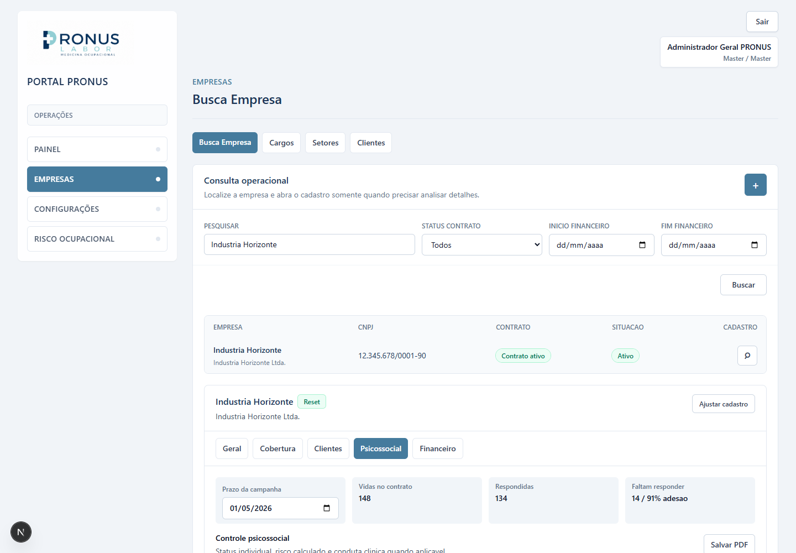

# Pronus Labor 360

Pronus Labor 360 e uma plataforma para transformar a gestao de saude ocupacional, riscos trabalhistas e bem-estar corporativo em uma operacao digital, auditavel e orientada por dados.

A proposta vai alem de um ERP tradicional. O produto nasce para conectar, em uma unica base, a operacao tecnica da PRONUS, o RH das empresas clientes e a jornada do colaborador. O objetivo e reduzir retrabalho, aumentar confiabilidade juridica, acelerar entregas de SST e criar inteligencia operacional sobre NR-01/GRO/PGR, risco psicossocial, documentos, indicadores e preparacao futura para eSocial.

## Galeria Visual Do Produto

Capturas demonstrativas atualizadas em 2026-04-30 para apresentacao do produto, validacao visual e apoio a conversas com investidores.

### Portais

| Portal PRONUS                                                           | Portal RH Cliente                                                   | Portal Colaborador                                                    |
| ----------------------------------------------------------------------- | ------------------------------------------------------------------- | --------------------------------------------------------------------- |
|  |  |  |

### Fluxos De Clientes

| Portal RH Cliente - Clientes                                             | Portal PRONUS - Clientes                                                         |
| ------------------------------------------------------------------------ | -------------------------------------------------------------------------------- |
|  |  |

### Login Dos Portais

| Login PRONUS                                                             | Login RH Cliente                                                         | Login Colaborador                                                          |
| ------------------------------------------------------------------------ | ------------------------------------------------------------------------ | -------------------------------------------------------------------------- |
|  |  |  |

### Fluxo Operacional De Reset

| Empresa aberta a partir do pedido de reset do Portal RH                                            |
| -------------------------------------------------------------------------------------------------- |
|  |

## Regra De Atualizacao Visual

Toda alteracao visual relevante no sistema deve atualizar tambem as capturas em `docs/assets/screenshots/` e a galeria acima no README. Essa regra faz parte do Definition of Done de qualquer mudanca em layout, identidade visual, navegacao, dashboards, telas de login ou fluxos apresentados a clientes e investidores.

As imagens publicadas no GitHub devem usar dados demonstrativos e nao devem expor CPF, dados medicos, informacoes financeiras, documentos reais ou qualquer dado sensivel de pessoas/empresas.

## Visao

Empresas lidam com saude ocupacional em um ambiente cada vez mais regulado, sensivel e fragmentado. Dados ficam espalhados em planilhas, documentos, sistemas isolados, e-mails e processos manuais. Isso cria risco juridico, perda de produtividade, pouca rastreabilidade e baixa capacidade de decisao.

O Pronus Labor 360 busca ser a camada operacional e estrategica que organiza esse ecossistema:

- para a PRONUS, uma central de execucao, controle tecnico e produtividade;
- para o RH cliente, uma visao clara do status da saude ocupacional contratada;
- para o colaborador, uma jornada digital simples, segura e responsiva;
- para a gestao, uma base de dados confiavel para indicadores, documentos, auditoria e expansao futura.

## O Problema Que Estamos Resolvendo

A saude ocupacional brasileira exige cadastros consistentes, documentos corretos, rastreabilidade, privacidade e resposta rapida a mudancas reguladoras. Ao mesmo tempo, a inclusao de riscos psicossociais no centro da agenda corporativa aumenta a necessidade de processos bem desenhados, dados agregados e protecao de informacoes sensiveis.

O mercado ainda opera, em grande parte, com ferramentas desconectadas. Isso torna dificil:

- saber se a base cadastral esta correta;
- acompanhar a evolucao de PGR, inventario de riscos e planos de acao;
- executar campanhas psicossociais com privacidade e governanca;
- entregar documentos com controle de versao e evidencia;
- impedir vazamento de dados entre empresas e colaboradores;
- medir produtividade operacional e valor entregue ao cliente.

## Proposta De Valor

O Pronus Labor 360 foi pensado como uma plataforma 360 graus para a relacao entre operadora, empresa e colaborador.

Principais pilares:

- **Cadastro estrutural confiavel:** grupos, empresas, CNPJs, unidades, setores, cargos, clientes e colaboradores internos em uma base organizada.
- **Inteligencia regulatoria SST:** leitura de CNAE, grau de risco, obrigacoes legais, checklist tecnico e base automatica para PGR, PCMSO, LTCAT, PPP e eSocial SST.
- **Governanca de dados:** isolamento por empresa, status, historico, aprovacao de divergencias e trilhas de auditoria.
- **Risco ocupacional / NR-01/GRO/PGR:** base preparada para inventario de riscos, matriz, planos de acao, evidencias e documentos.
- **Risco psicossocial:** campanhas, questionarios, indicadores agregados, regras de privacidade e suporte a analise tecnica.
- **Gestao documental:** estrutura para controlar documentos, modelos, publicacoes, assinaturas, evidencias e rastreabilidade.
- **Operacao escalavel:** portais separados para PRONUS, RH Cliente e Colaborador.
- **Preparacao futura:** arquitetura pensada para eSocial SST, BI avancado, teleatendimento e automacoes inteligentes.

## Portais

```text
apps/
  web-pronus/      Portal operacional PRONUS
  web-client/      Portal RH Cliente
  web-employee/    Portal Colaborador
  api/             API Node.js/NestJS
packages/
  ui/              Componentes compartilhados
  config/          Configuracoes compartilhadas
  types/           Tipos compartilhados
  validations/     Validacoes compartilhadas
  database/        Prisma, schema e acesso ao banco
docs/              Documentacao de produto, arquitetura, dados e fluxos
```

## Estado Atual

A versao atual ja demonstra os fluxos centrais do produto e serve como base operacional para evolucao tecnica, apresentacoes comerciais e validacao com clientes.

Ja existe:

- monorepo com pnpm workspaces;
- tres portais Next.js;
- API NestJS;
- schema inicial Prisma;
- cadastro estrutural inicial na API;
- endpoints para empresas, unidades, setores, cargos e colaboradores;
- importacao inicial de colaboradores via CSV com modelo baixavel, modo de simulacao, erro por linha/campo e confirmacao clara ao importar;
- painel operacional inicial no Portal PRONUS com navegacao por paginas;
- modulo Empresas do Portal PRONUS organizado em resumo, busca, cargos e setores;
- modulo Configuracoes com CNAE, grau de risco, checklist tecnico, estruturas e parametros operacionais;
- API inicial de inteligencia regulatoria com CNAEs parametrizados, graus de risco, obrigacoes legais, score, alertas e checklist de campo;
- cadastro de empresa com leitura visual do CNAE parametrizado, grau de risco e obrigacoes vinculadas;
- aba Clientes dentro do modulo Empresas para funcionarios das contratantes, com importacao e consulta sob busca;
- busca de empresas com lista, abertura por cadastro e abas de dados gerais, cobertura contratual, clientes e financeiro;
- cargos e setores como catalogos transversais por perfil de uso, preparados para clientes, RH, gestores, administrativo PRONUS e corpo clinico PRONUS;
- modulo Colaboradores com Usuarios, permissoes do sistema, agenda do corpo clinico, feriados e tabela de pagamento profissional;
- telas de login para Portal PRONUS, Portal RH Cliente e Portal Colaborador, com troca obrigatoria quando o usuario acessa pela senha padrao;
- login administrativo do Portal PRONUS por CPF, com perfil Administrador Geral, acesso full e acesso administrativo demonstrativo;
- reset de senha de usuarios administrativos e corpo clinico PRONUS pelo modulo Colaboradores;
- login do Portal Colaborador por CPF e login do Portal RH Cliente por CNPJ, com senha inicial baseada nos seis primeiros digitos do documento;
- pedidos de reset de senha: colaborador solicita no login, RH libera pelo painel, e empresa/RH solicita no login para liberacao pela operacao PRONUS;
- logo oficial aplicada aos portais e favicon do produto configurado;
- fluxo de primeiro acesso do colaborador com troca de senha, conferencia cadastral e bloqueio de consultas ate validacao;
- Portal RH Cliente com navegacao real por Painel, Clientes, Divergencias, Documentos, Risco Ocupacional e Psicossocial;
- painel RH Cliente com indicadores da empresa, pendencias cadastrais, documentos, assinaturas, riscos, plano de acao e campanhas psicossociais;
- area Clientes do Portal RH com busca por nome, CPF, setor, cargo e status, mantendo a lista vazia ate a consulta;
- area Clientes do Portal RH com inclusao, alteracao e desligamento direto de clientes ativos, mantendo acoes por linha e busca sem listagem inicial;
- area Divergencias do Portal RH preparada para aprovar ou recusar divergencias cadastrais via API;
- modulo Risco Ocupacional com abas de inventario de riscos, plano de acao, evidencias e documentos;
- base inicial de risco psicossocial com campanhas, questionario, adesao, sinais por setor e regras de privacidade;
- Pesquisa de Clima Organizacional no Portal Colaborador, com 46 perguntas importadas da planilha-base, salvamento progressivo local, blocos por tema e termometro de progresso;
- configuracao local de acesso para testes em `.data/access-state.json`, mantendo credenciais e pedidos de reset entre reinicios do servidor;
- modulo Documentos com fila documental, modelos, publicacoes e solicitacoes de assinatura;
- documentacao funcional e tecnica em `docs/`.

Ainda esta em andamento:

- persistencia definitiva com Prisma/Supabase para substituir as sementes e a persistencia local de demo;
- autenticacao e permissoes completas com auditoria, expiracao de senha e isolamento multiempresa;
- reconciliacao avancada de planilhas com unidades, setores e cargos;
- visao multiempresa real no Portal RH Cliente, com selecao segura por usuario autenticado;
- backend definitivo para auditoria, historico e notificacoes das movimentacoes cadastrais do RH cliente, sem aprovacao PRONUS obrigatoria quando a regra de negocio for responsabilidade do RH;
- persistencia real dos formularios de risco ocupacional, documentos e evidencias anexas;
- carga oficial completa de CNAE/Grau de Risco, dimensionamento exato de CIPA/SESMT e revisao juridico-tecnica das regras reguladoras;
- relatorios psicossociais, anonimato por regra minima e plano de intervencao;
- anexos reais, auditoria documental e dashboards avancados.

## Sinais De Tracao Do Produto

A versao atual ja demonstra a tese central do produto: uma base unica que conecta operacao, RH e colaborador sem perder governanca.

- A operacao PRONUS ja visualiza empresas, CNPJs, estrutura, clientes, NR-01 e risco psicossocial em um painel inicial.
- O RH Cliente ja tem uma porta de entrada para acompanhar pendencias cadastrais e reduzir retrabalho.
- O colaborador ja acessa por login, troca a senha inicial, confirma o cadastro, solicita consultas dentro das regras e responde o questionario comportamental.
- A API ja organiza dominios separados para estrutura, primeiro acesso, NR-01 e risco psicossocial.
- A arquitetura ja esta preparada para evoluir para banco real, autenticacao, permissoes, documentos e automacoes.

Essa combinacao torna o Pronus Labor 360 mais que um sistema interno. Ele aponta para uma plataforma vertical de saude ocupacional, com potencial de receita recorrente, inteligencia regulatoria e dados operacionais de alto valor para empresas que precisam cuidar de pessoas com rastreabilidade.

## Stack Definida

- Next.js + React + TypeScript + Tailwind nos tres portais.
- NestJS no backend.
- PostgreSQL via Supabase.
- Prisma como ORM.
- pnpm workspaces.

## Primeiros Comandos

Depois de instalar dependencias:

```bash
pnpm install
pnpm dev
```

Comandos uteis:

```bash
pnpm build
pnpm typecheck
pnpm dev:pronus
pnpm dev:api
```

Os acessos demonstrativos do ambiente local ficam documentados em
[`docs/acessos-teste-portais.md`](docs/acessos-teste-portais.md). As telas de login nao devem
exibir credenciais de teste.

## Roadmap Do Produto

1. Cadastro estrutural: empresas, unidades, setores, cargos e colaboradores.
2. Importacao e validacao de colaboradores.
3. Autenticacao e isolamento multiempresa.
4. Inteligencia regulatoria por CNAE, grau de risco, obrigacoes e checklist tecnico.
5. Primeiro acesso do colaborador e divergencia cadastral.
6. Nucleo de risco ocupacional / NR-01/GRO/PGR.
7. Campanhas de risco psicossocial.
8. Questionario psicossocial do colaborador.
9. Documentos iniciais e auditoria.

## Tese De Produto

O Pronus Labor 360 nasce de uma necessidade real: transformar saude ocupacional em uma operacao digital, rastreavel e escalavel. A oportunidade esta em unir conhecimento tecnico de SST, experiencia operacional da PRONUS e uma plataforma moderna capaz de criar vantagem competitiva, previsibilidade e novos modelos de receita.

Em um mercado pressionado por conformidade, privacidade, produtividade e cuidado com pessoas, a plataforma busca ocupar um espaco estrategico: ser o sistema operacional da saude ocupacional corporativa.

## Documentacao

A documentacao de produto, arquitetura, dados e fluxos esta em `docs/`.
