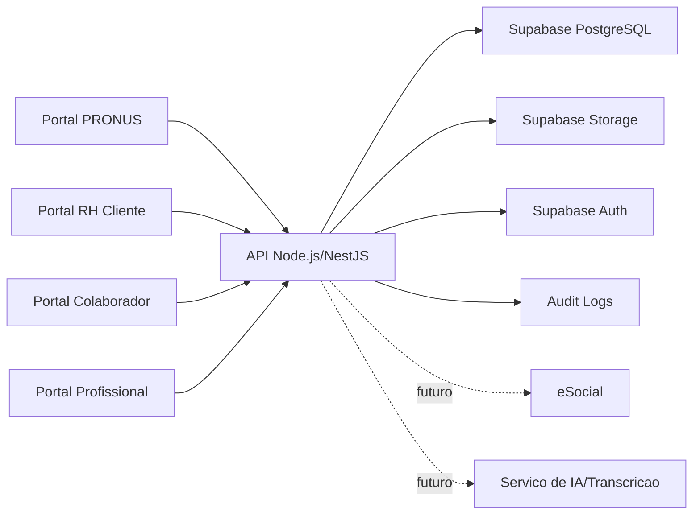

# Pronus Labor 360 - Arquitetura Tecnica Inicial

Versao: 0.1  
Data: 2026-04-26  
Status: Arquitetura proposta antes do desenvolvimento

## 1. Objetivo

Este documento descreve a arquitetura tecnica inicial do Pronus Labor 360.

Ele serve para explicar, de forma clara, como o sistema sera organizado antes de iniciar o desenvolvimento.

O objetivo e equilibrar:

- Velocidade de entrega.
- Seguranca.
- Manutencao futura.
- Escalabilidade.
- Preparacao para LGPD, NR-01/PGR, psicossocial, documentos e eSocial.

## 2. Decisao Geral de Arquitetura

O projeto deve iniciar como um monorepo.

Monorepo significa que o projeto fica em um unico repositorio, mas dividido em partes organizadas.

Vantagens para o Pronus Labor 360:

- Desenvolvimento mais rapido no inicio.
- Menos complexidade operacional.
- Reaproveitamento de componentes entre portais.
- Reaproveitamento de tipos TypeScript entre frontend e backend.
- Mais facil de manter enquanto o produto ainda esta amadurecendo.

## 3. Stack Tecnica Recomendada

### 3.1 Frontend

Tecnologias:

- React.js
- TypeScript
- Tailwind CSS
- Next.js

Decisao:
Usar Next.js, porque teremos portais, autenticacao, areas protegidas, dashboards e crescimento futuro.

### 3.2 Backend

Tecnologias:

- Node.js
- TypeScript
- API propria

Opcoes possiveis:

- NestJS: mais estruturado, bom para ERP e regras de negocio complexas.
- Fastify: mais leve e rapido, exige mais decisoes de arquitetura.

Decisao:
Usar NestJS, porque o Pronus Labor 360 tera muitos modulos, permissoes, auditoria, regras de negocio, integracoes e necessidade de organizacao a longo prazo.

### 3.3 Banco de Dados

Tecnologia:

- PostgreSQL

Servico recomendado:

- Supabase PostgreSQL no desenvolvimento/homologacao/producao inicial.

Motivos:

- Acelera criacao do banco.
- Oferece painel administrativo.
- Pode apoiar autenticacao.
- Pode oferecer storage.
- Reduz carga operacional inicial.

### 3.4 Autenticacao

Opcao recomendada:

- Supabase Auth como acelerador inicial.

Cuidados:

- Integrar usuarios do Supabase com tabela interna `users`.
- Nao depender apenas da permissao visual do frontend.
- Validar permissoes no backend/API.
- Registrar logs de acesso e acoes sensiveis.

### 3.5 Storage de Arquivos

Opcao recomendada:

- Supabase Storage no inicio.

Arquivos previstos:

- PDFs.
- Evidencias.
- Documentos anexados.
- Modelos de documentos.
- Futuros anexos clinicos.
- Futuro audio temporario para transcricao.

Cuidados:

- Separar buckets por tipo de documento.
- Definir regras de acesso por perfil.
- Evitar links publicos para dados sensiveis.
- Registrar acesso a documentos sensiveis.

## 4. Portais do Sistema

O Pronus Labor 360 tera quatro portais principais.

### 4.1 Portal PRONUS

Publico:

- Equipe administrativa.
- Financeiro.
- Atendimento.
- Tecnicos SST.
- Medico coordenador.
- Profissionais de saude.
- Suporte.
- Gerentes.

Caracteristica visual:
ERP operacional moderno, denso, eficiente e seguro.

Funcionalidades iniciais:

- Cadastro de grupos, empresas, unidades, setores, cargos e colaboradores.
- Gestao de campanhas psicossociais.
- Visualizacao de percentual de respostas.
- Agrupamento de setores pequenos.
- NR-01/GRO/PGR.
- Inventario de riscos.
- Plano de acao.
- Evidencias.
- Documentos.
- Auditoria.

### 4.2 Portal RH Cliente

Publico:

- RH da empresa cliente.

Caracteristica visual:
Executivo, claro, confiavel e orientado a indicadores.

Funcionalidades iniciais:

- Dashboard basico.
- Colaboradores ativos.
- Riscos contratados.
- Risco agregado por setor/grupo.
- Risco geral da empresa.
- Documentos disponiveis.
- Pendencias cadastrais.

Restricoes:

- Nao ve prontuario.
- Nao ve resposta individual.
- Nao ve risco psicossocial individual.
- Nao ve percentual de resposta da campanha psicossocial.

### 4.3 Portal Colaborador

Publico:

- Colaboradores das empresas clientes.

Caracteristica visual:
Simples, acolhedor, responsivo e com baixa complexidade.

Funcionalidades iniciais:

- Acesso por CPF previamente cadastrado.
- Primeiro acesso.
- Confirmacao/complementacao cadastral.
- Aceite de termos.
- Resposta de questionario psicossocial, se cadastro estiver validado.

Restricoes:

- Se houver divergencia cadastral pendente, o colaborador fica bloqueado ate validacao do RH.
- Nao acessa prontuario completo.

### 4.4 Portal Profissional de Saude

Publico:

- Medicos.
- Psicologos.
- Nutricionistas.
- Outros profissionais autorizados pela PRONUS.

Caracteristica visual:
Ambiente clinico objetivo, seguro e focado no atendimento.

Funcionalidades iniciais:

- Agenda do dia.
- Videochamada demonstrativa.
- Anamnese e finalizacao da consulta.
- Financeiro do profissional.
- Busca de prontuario integrado do trabalhador.
- Resumo demonstrativo de prontuario para preparacao do atendimento.

Restricoes:

- Acesso deve respeitar sigilo profissional.
- Dados psicologicos e clinicos sensiveis nao podem ser expostos para perfis administrativos.
- Toda consulta a prontuario deve gerar log de acesso.

## 5. Organizacao Recomendada do Monorepo

Estrutura proposta:

```text
apps/
  web-pronus/
  web-client/
  web-employee/
  web-clinician/
  api/
packages/
  ui/
  config/
  types/
  validations/
  database/
docs/
```

### 5.1 apps/web-pronus

Aplicacao frontend do Portal PRONUS.

### 5.2 apps/web-client

Aplicacao frontend do Portal RH Cliente.

### 5.3 apps/web-employee

Aplicacao frontend do Portal Colaborador.

### 5.4 apps/api

Backend/API Node.js + TypeScript.

Responsavel por:

- Regras de negocio.
- Validacao de permissao.
- Auditoria.
- Comunicacao com banco.
- Preparacao futura para eSocial.
- Preparacao futura para transcricao e IA.

### 5.5 apps/web-clinician

Aplicacao frontend do Portal Profissional de Saude.

Responsavel por:

- atendimento por video;
- anamnese;
- resumo do prontuario;
- busca de prontuario integrado;
- financeiro individual do profissional.

### 5.6 packages/ui

Biblioteca compartilhada de componentes visuais.

Exemplos:

- Botao.
- Campo de formulario.
- Layout base.
- Tabela.
- Modal.
- Indicador de risco.
- Farol de status.

### 5.7 packages/types

Tipos TypeScript compartilhados entre frontend e backend.

### 5.8 packages/validations

Validacoes compartilhadas.

Exemplos:

- CPF.
- CNPJ.
- Campos obrigatorios.
- Regras de formulario.

### 5.9 packages/database

Schema, migrations, seed inicial e configuracoes de banco, caso usemos uma ferramenta como Prisma ou Drizzle.

## 6. Banco de Dados e ORM

Para Node.js + TypeScript, ha duas boas opcoes:

### Opcao A - Prisma

Vantagens:

- Muito conhecido.
- Boa documentacao.
- Facil de entender.
- Bom para produtividade.

Cuidados:

- Algumas operacoes avancadas de PostgreSQL exigem SQL manual.
- Com Supabase, precisa cuidado com Row Level Security se decidirmos usar RLS fortemente.

### Opcao B - Drizzle

Vantagens:

- Mais proximo do SQL.
- Muito bom para TypeScript.
- Leve e explicito.

Cuidados:

- Pode exigir mais conhecimento tecnico.

Decisao:
Usar Prisma no inicio, pela velocidade e clareza. Se em algum ponto o projeto exigir SQL mais fino, podemos usar queries SQL especificas sem abandonar Prisma.

## 7. Seguranca

### 7.1 Principios

- Nunca confiar apenas no frontend.
- Validar permissao no backend.
- Registrar acoes relevantes.
- Separar dados por cliente.
- Restringir dados clinicos e psicossociais individuais.
- Evitar URLs publicas para documentos sensiveis.

### 7.2 Isolamento de cliente

Toda consulta sensivel deve considerar:

- `organization_group_id`
- `company_id`
- papel do usuario
- permissoes do usuario

### 7.3 Auditoria

A API deve gerar logs para:

- Alteracoes cadastrais.
- Aprovacoes e recusas.
- Alteracoes de risco.
- Publicacao de documentos.
- Acesso a dados sensiveis.
- Bloqueios/desbloqueios.
- Futuras alteracoes de prontuario.

### 7.4 Dados psicossociais

Respostas individuais so podem ser acessadas por:

- Profissional de saude autorizado.
- Gerente PRONUS autorizado.

Cliente ve apenas dados agregados e respeitando agrupamento minimo.

## 8. Ambientes

O projeto deve ter pelo menos tres ambientes.

### 8.1 Desenvolvimento

Uso:

- Desenvolvimento local.
- Testes iniciais.
- Dados ficticios.

### 8.2 Homologacao

Uso:

- Validacao pela PRONUS.
- Teste de fluxo completo.
- Dados simulados ou anonimizados.

### 8.3 Producao

Uso:

- Clientes reais.
- Dados reais.
- Regras fortes de seguranca, backup e auditoria.

Observacao:
Nao devemos misturar dados reais com ambiente de desenvolvimento.

## 9. Infraestrutura Inicial

### 9.1 Desenvolvimento local

Na sua maquina, provavelmente precisaremos instalar:

- Git.
- Node.js LTS.
- pnpm.
- Docker Desktop.
- VS Code, opcional mas recomendado.
- Supabase CLI, se formos rodar Supabase localmente.

Tambem poderemos usar:

- PostgreSQL local, se decidirmos nao depender apenas do Supabase remoto no desenvolvimento.

### 9.2 Supabase

Usos iniciais:

- Banco PostgreSQL.
- Autenticacao.
- Storage.

Cuidados:

- Criar projeto separado para homologacao e producao.
- Configurar variaveis de ambiente.
- Nao expor chaves secretas no frontend.
- Criar politicas de acesso documentadas.

### 9.3 Deploy futuro

Decisao atual para homologacao externa:

- AWS para publicar os quatro frontends Next.js.
- Supabase para PostgreSQL, Auth, Storage, Row Level Security e auditoria.
- API NestJS como camada de negocio para permissoes, regras reguladoras, logs e integracoes.

Observacao tecnica:
O Supabase nao substitui automaticamente a hospedagem da API NestJS. Se a API continuar em NestJS, ela deve ser publicada em um runtime proprio, como AWS App Runner, ECS/Fargate ou Lambda. O Supabase fica como backend gerenciado de dados, autenticacao e arquivos.

Documento operacional:
Ver `docs/plano-deploy-aws-supabase.md`.

## 10. Dominio

Pode ser interessante comprar o dominio cedo para proteger a marca.

Dominio escolhido:

- pronuslabor.com.br

Recomendacao:
Comprar o dominio agora para proteger a marca, mas nao contratar hospedagem completa ainda.

## 11. Fluxo Geral de Comunicacao



## 12. Decisoes Confirmadas

- O projeto sera monorepo.
- Havera quatro portais: PRONUS, RH Cliente, Colaborador e Profissional de Saude.
- Frontend sera Next.js + React.js + TypeScript + Tailwind.
- Backend sera Node.js + TypeScript.
- Backend sera NestJS.
- Banco principal sera PostgreSQL.
- Supabase pode ser usado para PostgreSQL, Auth e Storage.
- ORM sera Prisma.
- Tabelas e codigo terao nomes em ingles tecnico.
- Documentacao e dicionario de dados ficarao em portugues.
- AWS nao deve ser contratada antes do prototipo/MVP estar mais claro.
- Dominio escolhido: pronuslabor.com.br.

## 13. Decisoes Ainda Pendentes

Antes do desenvolvimento, ainda precisamos confirmar:

1. Usaremos Supabase remoto desde o inicio ou Supabase local com Docker?
2. Onde sera hospedada a primeira homologacao?
3. Qual politica inicial de backup?
4. Qual politica inicial de retencao de documentos e logs?
5. Quais dados serao criptografados em nivel de aplicacao alem da seguranca do banco?

## 14. Proximo Passo Recomendado

Criar um checklist de preparacao do ambiente local, com instrucoes simples para instalar:

- Git.
- Node.js LTS.
- pnpm.
- Docker Desktop.
- VS Code.
- Conta Supabase.

Depois disso, podemos criar o scaffold inicial do projeto.
