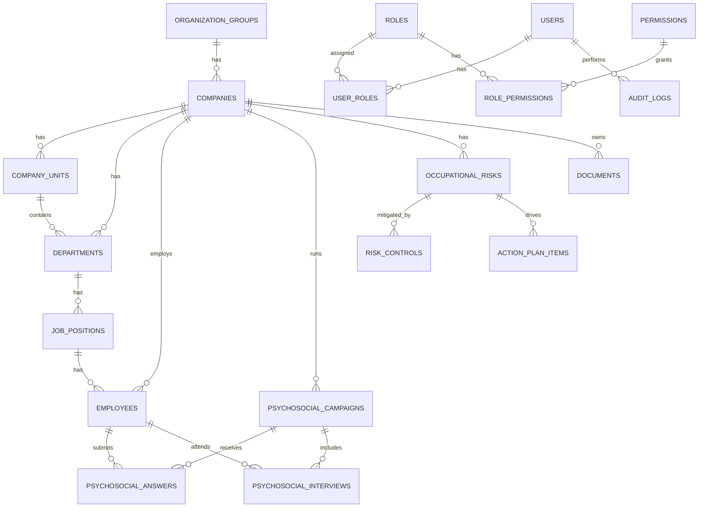

# Pronus Labor 360 - Modelo de Dados Inicial

Versao: 0.1  
Data: 2026-04-26  
Status: Desenho conceitual antes do desenvolvimento

## 1. Objetivo

Este documento descreve o modelo de dados inicial do Pronus Labor 360 em linguagem funcional e tecnica leve.

Ele ainda nao e o banco de dados definitivo, mas serve como mapa para:

- Entender quais informacoes o sistema precisa guardar.
- Evitar perda de regras importantes.
- Preparar o desenho do PostgreSQL.
- Apoiar a criacao futura das APIs e telas.
- Manter o sistema preparado para NR-01, PGR, risco psicossocial, documentos, auditoria e eSocial futuro.

## 2. Principios do Modelo

### 2.1 Multiempresa desde o inicio

Todos os dados de cliente devem estar vinculados a uma estrutura organizacional clara:

Grupo empresarial > Empresa/CNPJ > Unidade > Setor > Cargo > Colaborador

Isso permite que:

- A PRONUS opere varios clientes.
- O cliente veja apenas seus dados.
- O sistema evolua para SaaS no futuro.
- Dashboards sejam filtrados por grupo, empresa, unidade, setor e periodo.

### 2.2 Separacao entre dados administrativos e dados clinicos

O sistema deve diferenciar:

- Dados administrativos: cadastro, empresa, setor, cargo, contrato, documentos legais.
- Dados ocupacionais: riscos, PGR, evidencias, ASO, inventario.
- Dados psicossociais: questionarios, entrevistas, classificacoes e indicadores.
- Dados clinicos: prontuario, evolucoes, encaminhamentos e informacoes de saude individual.

No MVP, o foco e administrativo, ocupacional e psicossocial. O modelo deve preparar a separacao dos dados clinicos para a etapa de teleatendimento/prontuario.

### 2.3 Auditoria como parte do produto

Alteracoes relevantes devem gerar historico:

- Quem fez.
- Quando fez.
- O que mudou.
- Valor anterior.
- Valor novo.
- Qual cliente/empresa foi afetado.

Auditoria nao deve ser pensada como detalhe tecnico; ela e parte do valor juridico e operacional do produto.

### 2.4 Privacidade psicossocial

O cliente PJ nao visualiza:

- Respostas individuais.
- Nome de colaborador associado a risco psicossocial.
- Pessoas selecionadas para entrevista.
- Conteudo de entrevista.

A PRONUS visualiza dados individuais apenas por perfis autorizados, como profissional de saude e gerente.

Setores com menos de 5 pessoas devem ser agrupados antes de exibicao ao cliente.

### 2.5 Padrao de nomes tecnicos

As tabelas, colunas, APIs e nomes internos de codigo devem usar ingles tecnico.

Motivos:

- Melhor integracao com Node.js, TypeScript, bibliotecas e ferramentas.
- Mais facilidade para manter padroes de desenvolvimento.
- Melhor compatibilidade com documentacoes tecnicas.

Para facilitar entendimento operacional, sera mantido um dicionario de dados em portugues explicando tabelas e campos.

### 2.6 Supabase como acelerador inicial

O projeto pode usar Supabase para acelerar:

- PostgreSQL gerenciado.
- Autenticacao.
- Storage de arquivos.
- Regras de seguranca.

Condicoes:

- Tudo deve ser documentado.
- Regras de acesso precisam respeitar isolamento por cliente.
- Dados sensiveis devem seguir politicas fortes de permissao e auditoria.
- O desenho deve permitir evoluir ou migrar no futuro, caso necessario.

## 3. Dominios do Banco

O modelo inicial sera organizado nos seguintes dominios:

1. Identidade e acesso.
2. Estrutura organizacional.
3. Colaboradores.
4. Auditoria e logs.
5. NR-01/GRO/PGR.
6. Psicossocial.
7. Documentos.
8. Faturamento e contratos, preparado para pos-MVP.
9. Agenda e teleatendimento, preparado para futuro.
10. eSocial, preparado para futuro.

## 4. Identidade e Acesso

### 4.1 users

Representa qualquer pessoa que acessa o sistema.

Exemplos:

- Colaborador interno PRONUS.
- RH Cliente.
- Profissional de saude.
- Colaborador da empresa cliente.

Campos principais:

- id
- name
- email
- cpf
- phone
- password_hash ou referencia ao provedor de autenticacao
- user_type
- status
- last_login_at
- created_at
- updated_at

Tipos sugeridos de usuario:

- pronus_admin
- pronus_health_professional
- client_hr
- client_employee

Observacoes:

- CPF deve ser unico quando aplicavel.
- E-mail pode nao existir para todos os colaboradores no inicio.
- Para colaborador, o acesso so e permitido se o CPF estiver previamente cadastrado.

### 4.2 roles

Representa papeis de acesso.

Papeis iniciais:

- Super admin
- Financeiro
- Atendimento
- Tecnico SST
- Medico coordenador
- Profissional de saude
- Suporte
- RH Cliente
- Colaborador
- Gerente PRONUS

Campos principais:

- id
- name
- description
- scope
- created_at
- updated_at

### 4.3 permissions

Representa permissoes especificas do sistema.

Exemplos:

- view_client_dashboard
- manage_companies
- manage_employees
- view_psychosocial_individual_answers
- manage_pgr
- publish_documents
- manage_billing
- view_audit_logs

Campos principais:

- id
- key
- description
- created_at
- updated_at

### 4.4 user_roles

Liga usuarios a papeis.

Campos principais:

- id
- user_id
- role_id
- organization_group_id
- company_id
- created_at

Observacao:
Permite que um usuario tenha um papel global PRONUS ou um papel restrito a uma empresa cliente.

### 4.5 role_permissions

Liga papeis a permissoes.

Campos principais:

- id
- role_id
- permission_id

## 5. Estrutura Organizacional

### 5.1 organization_groups

Representa grupo empresarial.

Campos principais:

- id
- name
- legal_name
- status
- created_at
- updated_at

Exemplo:
Grupo X.

### 5.2 companies

Representa empresa/CNPJ.

Campos principais:

- id
- organization_group_id
- trade_name
- legal_name
- cnpj
- state_registration
- municipal_registration
- cnae_main
- risk_grade
- address fields
- status
- created_at
- updated_at

Observacoes:

- Faturamento sera por CNPJ.
- Contratos e documentos tambem devem poder ser vinculados ao CNPJ.

### 5.3 company_units

Representa unidade/local de trabalho.

Campos principais:

- id
- company_id
- name
- code
- address fields
- status
- created_at
- updated_at

Exemplos:

- Matriz Recife.
- Unidade Industrial.
- Filial Administrativa.

### 5.4 departments

Representa setor.

Campos principais:

- id
- company_id
- company_unit_id
- name
- code
- status
- created_at
- updated_at

Observacao:
Setores sao fundamentais para agrupamento de risco psicossocial.

### 5.5 job_positions

Representa cargo.

Campos principais:

- id
- company_id
- department_id
- title
- cbo_code
- description
- status
- created_at
- updated_at

Observacao:
CBO pode ser importante para documentos ocupacionais e eSocial futuro.

## 6. Colaboradores

### 6.1 employees

Representa colaborador de uma empresa cliente.

Campos principais:

- id
- user_id
- company_id
- company_unit_id
- department_id
- job_position_id
- cpf
- full_name
- social_name
- birth_date
- sex
- email
- phone
- whatsapp
- employee_registration
- worker_category_code
- admission_date
- employment_status
- has_medical_plan
- has_dental_plan
- has_life_insurance
- first_access_completed_at
- registration_status
- created_at
- updated_at

Campos administrativos/futuros:

- address fields
- marital_status
- education_level
- nationality_country
- birth_country

Observacoes:

- O cadastro minimo deve ser orientado pelo eSocial.
- CPF, nome e data de nascimento sao dados centrais.
- Matricula e categoria do trabalhador sao relevantes para vinculo e eSocial futuro.
- Beneficios de saude sao informados pelo RH.

Status sugeridos:

- active
- inactive
- blocked
- pending_validation

### 6.2 employee_registration_changes

Guarda propostas de alteracao feitas pelo colaborador no primeiro acesso ou em atualizacoes futuras.

Campos principais:

- id
- employee_id
- submitted_by_user_id
- reviewed_by_user_id
- pronus_checked_by_user_id
- status
- submitted_data
- approved_data
- rejected_reason
- requires_pronus_check
- created_at
- reviewed_at
- pronus_checked_at

Status sugeridos:

- pending_hr_review
- pending_pronus_check
- approved
- rejected

Regras:

- Enquanto houver divergencia pendente, o colaborador fica bloqueado para responder questionarios e acessar funcionalidades internas.
- O RH e o aprovador formal.
- A PRONUS pode conferir dados sensiveis como etapa operacional.

### 6.3 employee_health_benefits_history

Guarda historico de beneficios de saude quando houver alteracao.

Campos principais:

- id
- employee_id
- has_medical_plan
- has_dental_plan
- has_life_insurance
- effective_from
- effective_to
- changed_by_user_id
- created_at

Observacao:
Pode ser simplificado no MVP se os beneficios forem apenas campos atuais em employees.

## 7. Auditoria e Logs

### 7.1 audit_logs

Registro geral de acoes relevantes.

Campos principais:

- id
- actor_user_id
- actor_role
- organization_group_id
- company_id
- action
- entity_type
- entity_id
- field_name
- old_value
- new_value
- metadata
- ip_address
- user_agent
- created_at

Acoes iniciais:

- user_login
- user_logout
- employee_created
- employee_updated
- registration_change_submitted
- registration_change_approved
- registration_change_rejected
- pgr_risk_created
- pgr_risk_updated
- psychosocial_campaign_created
- psychosocial_answer_submitted
- psychosocial_risk_adjusted
- document_generated
- document_published
- billing_changed
- client_blocked
- client_unblocked

Observacao:
Para mudancas com varios campos, o sistema pode registrar um log por campo ou um log unico com metadados estruturados.

## 8. NR-01 / GRO / PGR

### 8.1 risk_sources

Representa perigos ou fontes de risco.

Campos principais:

- id
- company_id
- name
- description
- risk_type
- created_by_user_id
- created_at
- updated_at

Tipos iniciais:

- physical
- chemical
- biological
- ergonomic
- accident
- psychosocial

### 8.2 occupational_risks

Representa risco ocupacional identificado.

Campos principais:

- id
- company_id
- company_unit_id
- department_id
- job_position_id
- employee_id
- risk_source_id
- description
- probability
- severity
- risk_level
- status
- identified_by_user_id
- validated_by_user_id
- identified_at
- validated_at
- created_at
- updated_at

Niveis:

- low
- moderate
- high
- critical

Observacoes:

- A matriz inicial sera probabilidade x severidade em escala 5x5.
- O risco pode ser associado em diferentes niveis: empresa, unidade, setor, cargo ou colaborador.

### 8.3 risk_controls

Representa medidas de controle.

Campos principais:

- id
- occupational_risk_id
- control_type
- description
- status
- responsible_user_id
- created_at
- updated_at

Tipos:

- elimination
- substitution
- engineering
- administrative
- ppe
- training
- monitoring

### 8.4 action_plans

Representa plano de acao.

Campos principais:

- id
- company_id
- title
- description
- status
- owner_user_id
- due_date
- created_at
- updated_at

### 8.5 action_plan_items

Representa itens do plano de acao.

Campos principais:

- id
- action_plan_id
- occupational_risk_id
- title
- description
- responsible_user_id
- due_date
- status
- completed_at
- created_at
- updated_at

### 8.6 evidences

Representa evidencias anexadas.

Campos principais:

- id
- company_id
- related_entity_type
- related_entity_id
- file_url
- file_name
- file_type
- description
- uploaded_by_user_id
- created_at

## 9. Psicossocial

### 9.1 psychosocial_campaigns

Representa campanha psicossocial de uma empresa.

Campos principais:

- id
- company_id
- name
- start_date
- end_date
- status
- response_threshold_percent
- assigned_analyst_user_id
- assigned_psychologist_user_id
- closed_by_user_id
- closed_at
- created_at
- updated_at

Status sugeridos:

- draft
- active
- threshold_reached
- expired
- extended
- closed
- analysis_in_progress
- completed

Regra:
O limite inicial de alerta e 89% de respostas.

### 9.2 psychosocial_questionnaires

Representa modelo de questionario.

Campos principais:

- id
- name
- version
- source_reference
- status
- created_at
- updated_at

Observacao:
Pode ser inspirado no COPSOQ, mas o conteudo final precisa ser definido antes da implementacao.

### 9.3 psychosocial_questions

Representa perguntas do questionario.

Campos principais:

- id
- questionnaire_id
- dimension
- question_text
- answer_type
- scale_min
- scale_max
- order_index
- is_active
- created_at
- updated_at

### 9.4 psychosocial_answers

Representa respostas individuais.

Campos principais:

- id
- campaign_id
- questionnaire_id
- employee_id
- submitted_at
- status
- created_at

Observacao:
Esta tabela representa a resposta geral/submissao do colaborador.

### 9.5 psychosocial_answer_items

Representa cada resposta por pergunta.

Campos principais:

- id
- psychosocial_answer_id
- question_id
- answer_value
- created_at

Restricao:
Acesso individual apenas para perfis autorizados.

### 9.6 psychosocial_scores

Representa pontuacao calculada.

Campos principais:

- id
- campaign_id
- employee_id
- department_id
- dimension
- raw_score
- normalized_score
- risk_level
- calculated_at

Niveis:

- low
- moderate
- high
- critical

### 9.7 psychosocial_department_groupings

Representa agrupamento de setores pequenos para exibicao ao cliente.

Campos principais:

- id
- campaign_id
- name
- confirmed_by_user_id
- confirmed_at
- created_at
- updated_at

### 9.8 psychosocial_department_grouping_items

Liga setores a um agrupamento.

Campos principais:

- id
- grouping_id
- department_id

### 9.9 psychosocial_interview_samples

Representa selecao de colaboradores para entrevista.

Campos principais:

- id
- campaign_id
- employee_id
- selected_by_system
- selection_reason
- risk_level_at_selection
- status
- created_at
- updated_at

Status sugeridos:

- selected
- scheduled
- completed
- skipped

### 9.10 psychosocial_interviews

Representa entrevista clinica psicossocial.

Campos principais:

- id
- campaign_id
- employee_id
- psychologist_user_id
- scheduled_at
- completed_at
- status
- clinical_notes
- final_risk_level
- adjustment_reason
- created_at
- updated_at

Restricao:
Conteudo clinico e tecnico individual nao aparece para o cliente.

### 9.11 psychosocial_final_results

Representa resultado final agregado apos analise.

Campos principais:

- id
- campaign_id
- company_id
- department_id
- grouping_id
- dimension
- final_risk_level
- employee_count
- calculated_at
- validated_by_user_id
- validated_at

Observacao:
Esta tabela alimenta dashboards e relatorios agregados.

## 10. Documentos

### 10.1 document_templates

Representa modelos de documentos.

Campos principais:

- id
- name
- document_type
- version
- template_content
- status
- created_at
- updated_at

Tipos iniciais:

- aso
- pgr
- psychosocial_report
- action_plan
- risk_inventory
- lgpd_term

### 10.2 documents

Representa documento gerado/publicado.

Campos principais:

- id
- company_id
- document_template_id
- document_type
- title
- version
- status
- file_url
- responsible_technical_user_id
- generated_by_user_id
- published_by_user_id
- generated_at
- published_at
- created_at
- updated_at

Status:

- draft
- generated
- under_review
- published
- superseded
- canceled

### 10.3 document_access_logs

Registra acesso a documentos.

Campos principais:

- id
- document_id
- user_id
- accessed_at
- ip_address
- user_agent

## 11. Faturamento e Contratos - Preparacao Pos-MVP

### 11.1 contracts

Representa contrato por empresa/CNPJ.

Campos principais:

- id
- company_id
- name
- start_date
- end_date
- status
- billing_day
- created_at
- updated_at

### 11.2 contract_items

Representa itens de cobranca.

Campos principais:

- id
- contract_id
- item_type
- description
- unit_price
- quantity
- created_at
- updated_at

Tipos:

- per_capita
- service_package
- consultation_package

### 11.3 consultation_packages

Representa pacote de consultas por tipo.

Campos principais:

- id
- company_id
- contract_id
- specialty_type
- total_quantity
- used_quantity
- period_start
- period_end
- status
- created_at
- updated_at

### 11.4 client_block_status

Representa bloqueio por inadimplencia.

Campos principais:

- id
- company_id
- status
- reason
- blocked_at
- unblocked_at
- created_by_user_id
- updated_by_user_id

## 12. Agenda e Teleatendimento - Preparacao Futura

### 12.1 appointments

Representa consulta agendada.

Campos principais:

- id
- company_id
- employee_id
- professional_user_id
- appointment_type
- specialty_type
- scheduled_start_at
- scheduled_end_at
- status
- cancellation_reason
- no_show
- package_consumed
- created_at
- updated_at

### 12.2 medical_records

Representa prontuario integrado.

Campos principais:

- id
- employee_id
- status
- created_at
- updated_at

### 12.3 medical_record_entries

Representa evolucao/anotacao no prontuario.

Campos principais:

- id
- medical_record_id
- appointment_id
- professional_user_id
- specialty_type
- entry_type
- content
- status
- finalized_at
- created_at
- updated_at

### 12.4 medical_record_amendments

Representa adendo ou retificacao apos finalizacao.

Campos principais:

- id
- medical_record_entry_id
- professional_user_id
- content
- reason
- created_at

## 13. eSocial - Preparacao Futura

### 13.1 esocial_events

Representa fila futura de eventos.

Campos principais:

- id
- company_id
- employee_id
- event_type
- event_version
- payload
- status
- validation_errors
- sent_at
- response_protocol
- response_payload
- created_at
- updated_at

Eventos prioritarios:

- S-2210
- S-2220
- S-2221, quando aplicavel
- S-2240
- S-3000

Status:

- draft
- pending_validation
- validated
- ready_to_send
- sent
- accepted
- rejected
- corrected
- excluded

## 14. Relacionamentos Principais

Resumo dos principais relacionamentos:

- Um grupo empresarial tem muitas empresas.
- Uma empresa tem muitas unidades.
- Uma empresa/unidade tem muitos setores.
- Um setor tem muitos cargos.
- Um cargo pode ter muitos colaboradores.
- Um colaborador pertence a uma empresa, unidade, setor e cargo.
- Um usuario pode estar ligado a um colaborador, RH cliente, profissional PRONUS ou administrador PRONUS.
- Uma campanha psicossocial pertence a uma empresa.
- Uma campanha possui muitas respostas.
- Uma resposta pertence a um colaborador.
- Uma campanha pode ter varios agrupamentos de setores.
- Uma campanha pode gerar entrevistas psicossociais.
- Uma campanha gera resultados finais agregados.
- Um risco ocupacional pertence a uma empresa e pode ser associado a unidade, setor, cargo ou colaborador.
- Um risco pode ter controles, evidencias e itens de plano de acao.
- Documentos pertencem a uma empresa e podem ser gerados a partir de riscos, campanhas ou planos.

## 15. Diagrama Conceitual Resumido

## 16. Decisoes Pendentes

Antes de transformar este modelo em schema PostgreSQL, precisamos validar:

1. Campos obrigatorios finais do cadastro de empresa/CNPJ.
2. Campos obrigatorios finais do colaborador com base no eSocial.
3. Detalhamento final de regras de seguranca no Supabase.
4. Politica de armazenamento de anexos no Supabase Storage ou alternativa.
5. Definicao final de backup e retencao.
6. Formula inicial de risco psicossocial por dimensao.
7. Estrutura final do questionario psicossocial.
8. Regras de retencao de documentos, logs e dados clinicos.
9. Estrategia de ambientes: desenvolvimento, homologacao e producao.
10. Politica de criptografia para dados sensiveis.

## 17. Decisoes Confirmadas

- A matriz de risco NR-01/PGR sera 5x5.
- Os nomes internos de tabelas, campos e codigo serao em ingles tecnico.
- Sera criado e mantido dicionario de dados em portugues.
- Supabase pode ser usado para acelerar autenticacao, PostgreSQL e storage.
- Telefone, e-mail e endereco podem ser aprovados apenas pelo RH.
- Cargo, setor, data de admissao, matricula e categoria do trabalhador exigem conferencia operacional da PRONUS, mantendo o RH como aprovador formal.
